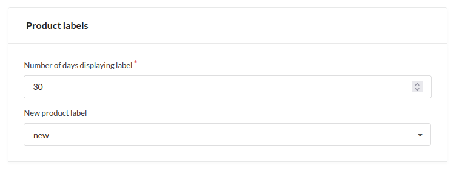

# Sylius Callout Plugin

The product label plugin for [Sylius](https://sylius.com/) allows you to add labels (badges) for products and other lists (like producers).  
Labels are easily manageable and assigned to product one by one. You can also configure extra label for new products  
displayed automatically within globally set timeframe.

## Screenshots

### Shop

### Admin

## Installation

- [Go to installation instructions](doc/installation.md)

## Usage

Basic usage is straightforward - add label and then assign it to product in product menu.  
If you want to display new product`s label go to channel settings, set amount of display days and select label to be used.  
New product label always comes in first, all the other labels are displayed by priority in descending order.  
